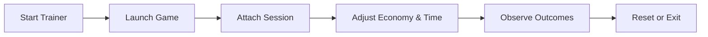

# Mall Simulator Trainer

A focused **desktop software utility** created for players who enjoy dissecting systems rather than rushing outcomes. Mall Simulator Trainer provides structured control over simulation parameters inside **Mall Simulator**, turning a busy commercial sandbox into a calm, observable laboratory.

This trainer is designed for **offline experimentation**, learning curves, and content setup—not competitive play.

---

## Why a Trainer for a Mall Simulator?

Mall simulators are quietly complex.
Behind storefronts and foot traffic live interlocking systems: rent curves, demand elasticity, staff efficiency, customer mood, and time pressure.

Mall Simulator Trainer exists to:

* Slow down economic feedback loops
* Test pricing and rent strategies safely
* Observe customer behavior without collapse risk
* Support accessibility and educational playstyles

Sometimes, insight blooms best when the clock stops ticking.

---

## Functional Scope

Mall Simulator Trainer exposes selected runtime variables in a readable, reversible way.

### Economy Controls

* Cash balance adjustment
* Rent and upkeep scaling
* Revenue and expense multipliers

### Time & Flow

* Time speed control
* Pause or step-through simulation ticks
* Day and season skipping for forecasting

### Customer Dynamics

* Foot traffic intensity
* Satisfaction and patience values
* Spending probability tuning

### Management Utilities

* Staff stamina and efficiency
* Maintenance cost overrides
* Event impact amplification or suppression

All changes are applied **live** and can be undone instantly.

---

## Design Philosophy

### Predictability

Every toggle maps to a single system. No chained side effects.

### Session-Bound Changes

Nothing persists unless explicitly saved. Restarting the game restores default behavior.

### Clean Separation

No save file edits. No asset replacement. Memory-only interaction.

### Calm Interface

Flat layout, descriptive labels, no nested menus. What you see is what you touch.

---

## Configuration & Customization

Advanced users can preload preferred values through a configuration file.

Example:

```ini
[economy]
money_multiplier=5.0
rent_scale=0.5

[time]
time_speed=0.25
pause_on_event=true

[customers]
traffic_density=1.8
satisfaction_lock=true
```

Invalid entries are ignored safely.

[!NOTE]
The trainer works perfectly without configuration files. Manual control remains fully available.

---

## Installation & Setup

1. Close Mall Simulator
2. Launch Mall Simulator Trainer
3. Start the game normally
4. Attach to the active session
5. Adjust simulation parameters as needed

No administrator rights, drivers, or startup hooks are required.

[!IMPORTANT]
Use this trainer only in **offline or personal environments**. Multiplayer or shared leaderboards may prohibit runtime modification.

---

## Typical Workflow



This loop encourages thoughtful iteration rather than reactive play.

---

## Frequently Asked Questions

**Does this affect save files permanently?**
No. All effects are runtime-only unless values are manually committed in-game.

**Can it help with learning pricing strategies?**
Yes. Time control and revenue scaling make trend observation much clearer.

**Is automation included?**
No bots, scripts, or auto-management features are provided.

**Will updates break it?**
Possibly. Simulation updates may require trainer adjustments.

---

## Closing Notes

Mall Simulator Trainer doesn’t build the mall for you.
It simply lifts the ceiling, quiets the noise, and lets you watch how people move, spend, and react.

For players who enjoy *understanding systems as stories*, this tool offers a slower, clearer way to listen.

Explore patiently. Adjust gently. Learn the rhythm of commerce.

---
